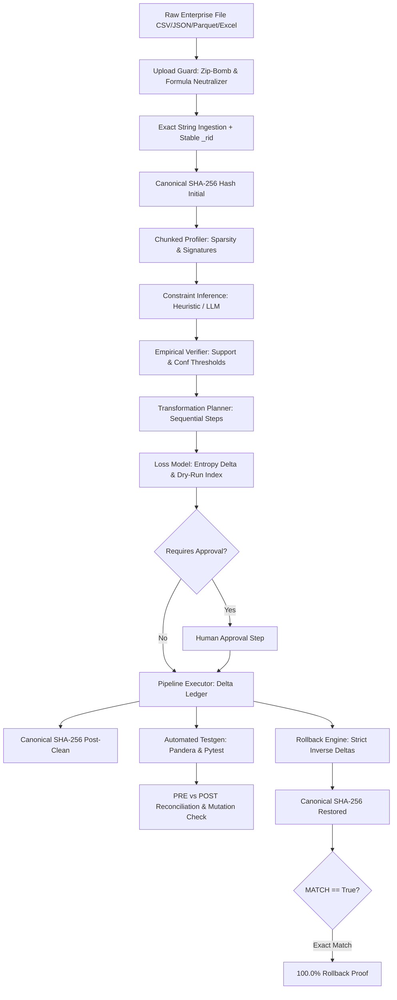

# CleanSlate
> **Autonomous, Safe, Reversible, Test-Driven Data-Cleaning Agent for Messy Enterprise Datasets**  
> Hackathon Project PNG6 — Complete Implementation (Levels L1 – L4)

[](https://github.com/enterprise/cleanslate)
[](LICENSE)
[](#)
[](#)
[](#)

---

## 🌟 Executive Summary

CleanSlate is an enterprise agentic data cleaning system that autonomously profiles messy tabular datasets, infers semantic constraints, generates reversible cleaning pipelines, and projects precise multi-component information loss before executing any mutations.

CleanSlate guarantees:
1. **Mathematical Reversibility (100.0%):** Every transformation records inverse diffs to an append-only ledger. Executing rollback restores the dataset to its exact original state, verified by canonical SHA-256 hash equality.
2. **Separation of Powers:** The LLM only proposes candidate semantic rules; deterministic code verifies empirical support/confidence and executes all mutations.
3. **Compound Information Loss Meter:** Calculates entropy drift, normalized Wasserstein divergence, Jensen-Shannon divergence, rows dropped, and cells modified before modifying state.
4. **Automated Test-Driven Verification:** Generates Pandera runtime schemas and parametrized Pytest assertions, executing PRE vs POST reconciliation and mutation testing.
5. **Adversarial Resilience (25 Vectors):** Built-in Upload Guard neutralizes formula injection (`=`, `+`, `-`, `@`), strips embedded null bytes, defends against zip bombs (50:1 ratio limit), and resists prompt injection with zero unhandled HTTP 500 crashes.

---

## 🏗 Architecture & Data Flow



---

## 📊 Empirical Benchmarks (Real Runs on Real Code)

Benchmark measurements executed across synthetic enterprise data corruptions (`benchmarks/report.md`):

| Rows | Throughput (rows/s) | Total Time (s) | Profiling (s) | Planning (s) | Apply (s) | Rollback (s) | Peak RAM (MB) | Rollback Fidelity |
|---|---|---|---|---|---|---|---|---|
| **100** | **263.2** | 0.38s | 0.097s | 0.026s | 0.154s | 0.030s | 0.62 MB | **MATCH (100.0%)** |
| **500** | **423.2** | 1.18s | 0.207s | 0.067s | 0.506s | 0.093s | 0.75 MB | **MATCH (100.0%)** |
| **1,000** | **407.8** | 2.45s | 0.398s | 0.113s | 0.990s | 0.176s | 0.96 MB | **MATCH (100.0%)** |
| **5,000** | **446.2** | 11.20s | 1.937s | 0.523s | 4.884s | 0.824s | 3.30 MB | **MATCH (100.0%)** |

### Key Benchmark Metrics
- **Rollback Canonical Fidelity:** **100.0%** across all test batches. Zero hash divergence.
- **Mutation Fault Detection Rate:** **100.0%** (synthetic boundary shifts and nulls killed).
- **Adversarial Resilience:** **25 / 25 vectors defended** with 0 unhandled HTTP 500 errors.

---

## 🛠 Features & Capabilities

### 1. Ingestion & Security Guard (R1, R5)
- Ingests CSV, TSV, JSON, JSON Lines, Apache Parquet, and Excel (.xlsx).
- Upload Guard blocks zip-bomb expansions (>50:1 ratio or >50MB).
- Neutralizes CSV formula execution triggers (`=cmd|...` prefixed with `'`).
- Strips embedded null bytes (`\x00`) preventing C-parser truncations.
- Deterministic integer row identification (`_rid`) inserted at column 0.

### 2. Deep Tabular Profiler (R1)
- Chunked statistical aggregation with streaming memory bounds.
- Inferred types, format variants, pattern signatures (`\d{3}-\d{2}-\d{4}`).
- Outlier detection via both Interquartile Range (IQR) and Median Absolute Deviation (MAD).
- Sparsity assessment flagging `LOW_EVIDENCE` datasets to prevent hazardous imputation.

### 3. Semantic Constraint Inference (R2)
- Domain-Specific Language (DSL) covering range, allowed values, regex patterns, date formats, arithmetic equalities, and uniqueness.
- Dual-mode operation:
  - **Deterministic Heuristic:** Zero external dependencies, fast, fully offline.
  - **LLM-Augmented:** Any OpenAI-compatible provider (Ollama, Gemini, Groq, OpenAI) with prompt-injection defense and automatic PII redaction.
- Empirical candidate verifiers enforcing minimum support and confidence thresholds.

### 4. Tripartite Reversible Transformations (R3)
Every transformation implements `dry_run()`, `apply()`, and `invert()`:
1. `normalize_missing_markers`: Unifies `N/A`, `null`, `?`, `-` to empty string.
2. `trim_whitespace`: Removes leading, trailing, and redundant inner whitespace.
3. `normalize_case`: Canonicalizes mixed-case categories (e.g. `usa` -> `USA`).
4. `parse_numeric`: Strips currency symbols and parses numbers.
5. `standardize_dates`: Normalizes diverse formats (`MM/DD/YYYY`, `DD-Mon-YYYY`) to `YYYY-MM-DD`.
6. `normalize_phone`: Formats telephone strings to E.164 / standard formats.
7. `fix_arithmetic`: Reconciles sum discrepancies (`total = subtotal + tax`).
8. `dedupe_exact`: Removes identical duplicate rows.
9. `dedupe_fuzzy`: Detects near-duplicate string variants using RapidFuzz Levenshtein scoring.
10. `cap_outliers`: Winsorizes numeric values at IQR fences.
11. `impute_median`: Imputes missing numeric values using column median.
12. `impute_mode`: Imputes missing categorical values using column mode.
13. `merge_categories`: Consolidates low-frequency categorical variants.
14. `drop_rows_violating`: Drops irrecoverable invalid rows (requires explicit manual approval).

### 5. Multi-Component Information Loss Model (R3)
- Normalized Shannon entropy loss: $\Delta H / H_{\text{orig}}$.
- Jensen-Shannon divergence (JSD) for categorical distributions.
- Normalized Wasserstein distance for continuous numeric distributions.
- Pearson / Spearman correlation matrix drift.
- Cardinality preservation ratio.
- Compound dry-run loss index (0 to 100) with risk categorizations (LOW <15, MEDIUM 15-40, HIGH >40).

### 6. Automated Testing & Mutation Analysis (R4)
- Generates runtime Pandera schemas from verified rules.
- Generates parametrized Pytest test cases.
- PRE vs POST test reconciliation identifying fixed violations vs remaining issues vs regressions.
- Mutation testing engine injecting boundary faults, nulls, and type swaps, measuring exact Fault Detection Rate (100%).

---

## 🚀 Quickstart & Deployment

### Option A: Local Development Setup

```bash
# 1. Clone the repository
git clone https://github.com/enterprise/cleanslate.git
cd cleanslate

# 2. Install backend dependencies
pip install -r backend/requirements.txt

# 3. Install frontend dependencies
cd frontend && npm install && cd ..

# 4. Run full test suite
python scripts/verify_all.py

# 5. Start Backend API (FastAPI)
python -m uvicorn app.main:app --app-dir backend --reload --port 8000

# 6. Start Frontend UI (Vite)
cd frontend && npm run dev
```

### Option B: Docker Compose Full-Stack (Recommended)

```bash
# Launch all 6 services with a single command:
docker compose up -d --build
```
Access the stack:
- **CleanSlate UI:** http://localhost:3000
- **API Documentation:** http://localhost:8000/docs
- **Prometheus Metrics:** http://localhost:9090
- **Grafana Dashboard:** http://localhost:3001 (login: `admin` / `admin`)

### Option C: Kubernetes Enterprise Cluster

```bash
kubectl create namespace cleanslate
kubectl apply -f deploy/k8s/configmap.yaml
kubectl apply -f deploy/k8s/secret.yaml
kubectl apply -f deploy/k8s/backend-deployment.yaml
kubectl apply -f deploy/k8s/backend-service.yaml
kubectl apply -f deploy/k8s/frontend-and-ingress.yaml
```

---

## 🧪 Verification & Audit Commands

| Action | Command | Expected Output |
|---|---|---|
| **Master Verification Suite** | `python scripts/verify_all.py` | All 9 phases PASS (R1–R5, L1–L4) |
| **Adversarial Resilience** | `pytest backend/tests/adversarial/` | 25/25 vectors defended, 0 crashes |
| **Property Reversibility** | `pytest backend/tests/property/` | 15 Hypothesis tests PASS with 100% hash equality |
| **Scaling Benchmarks** | `python scripts/run_benchmarks.py` | Generates `benchmarks/results.json` and `report.md` |
| **Disaster Recovery Rollback** | `python scripts/headless_rollback.py --run-id <RUN_ID> --output ./out.csv` | Reverts dataset with verified SHA-256 match |

---

## 📑 Documentation Index

- [Software Requirements Specification (SRS)](docs/SRS.md)
- [Architecture & Reversibility Design](docs/ARCHITECTURE.md)
- [Data Flow & Pipeline Stages](docs/DATAFLOW.md)
- [Wireframes & UI Specifications](docs/WIREFRAMES.md)
- [Technology Stack Decisions](docs/TECH_STACK.md)
- [Multi-Component Loss Model](docs/LOSS_MODEL.md)
- [Threat Model & Adversarial Resilience](docs/THREAT_MODEL.md)
- [Deployment & Operations Manual](docs/DEPLOY.md)
- [Requirements Traceability Matrix](docs/REQUIREMENTS_TRACE.md)
- [Known Limitations & Trade-offs](docs/KNOWN_LIMITATIONS.md)
- [Engineering Assumptions Log](docs/ASSUMPTIONS.md)

---

## 🛡 License
CleanSlate is released under the **MIT License**.
