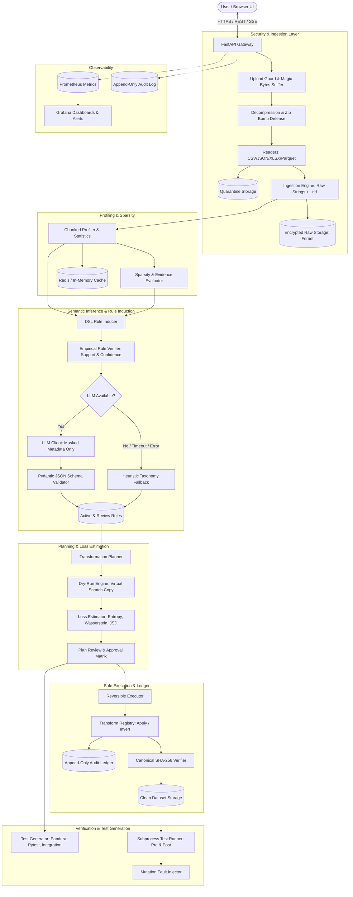
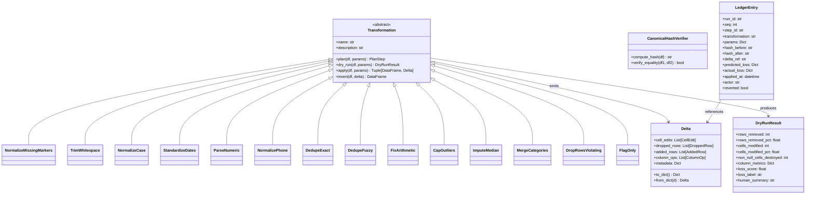
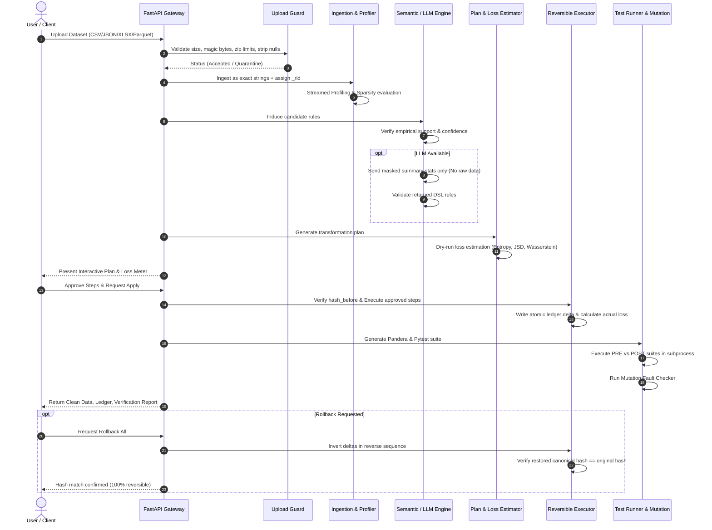

# CleanSlate - System Architecture
Document Version: 1.0.0
Compliance: Levels L1-L4

---

## 1. High-Level Architecture Overview

CleanSlate provides an enterprise-grade agentic data cleaning framework designed for safety, mathematical reversibility, and resilience against adversarial inputs. It couples deterministic profiling, validation, and rollback verification with decoupled AI inference.

---

## 2. Component Architecture & Separation of Concerns

---

## 3. Data Flow & Security Boundary

